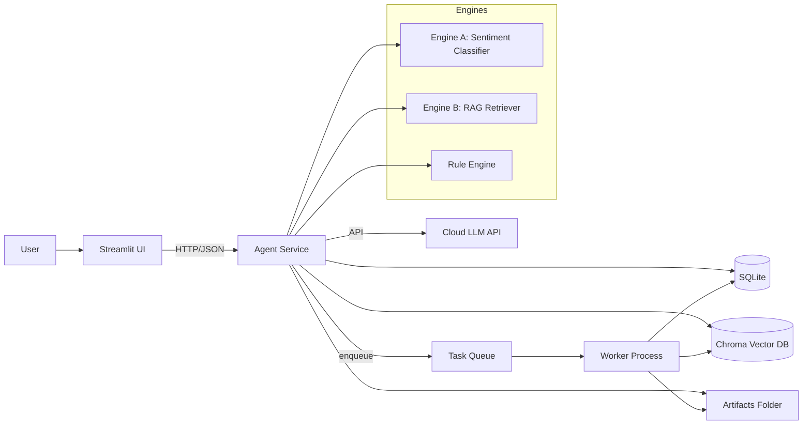

# Agent 独立 AI 进程：前后端与系统架构建议

更新时间：2026-02-07

本文基于当前仓库 `QuantSway_BETA` 的落地形态（Windows 本地部署、FastAPI + React + Tauri、子进程执行与 JSONL 协议经验、服务级重启与可观测优先）以及 `Agent/` 目录中毕业设计的既定路线（Streamlit UI、本地 CPU 推理、云端 LLM API）整理。

---

## 0. 给“内核实现者/本地大模型”的阅读指南（建议先读这一节再写代码）

本节的目标：让你在**不了解 QuantSway 代码细节**的情况下，也能按本文实现 Agent 的 `Core/Kernel`，并保证未来可被 QuantSway 松耦合集成。

### 0.1 长期计划（必须满足）

- **一个内核（Kernel/Core）**：同一套分析能力，供两套外壳复用。
- **两套外壳（Hosts/Shells）**：
  - **答辩外壳**：Streamlit 单体（追求视觉效果与演示流畅）。
  - **集成外壳**：FastAPI Agent Service（供 QuantSway 调用，前端以 hover 弹出标签页的方式展示）。

结论：你实现的核心代码应当以“Python 包”的形式存在，既能被 Streamlit import 调用，也能被 FastAPI import 调用。

### 0.2 QuantSway 平台最小背景（只列与集成相关的约束）

- **运行环境**：Windows 本地全栈应用。
- **主技术栈**：后端 FastAPI，前端 React（Vite），桌面壳 Tauri。
- **平台特征**：稳定优先、可观测优先；交易链路强调护栏（默认 dry_run、live 强校验）、以及审计/可追溯（orders/events/fills/portfolio 落库）。
- **集成方式预期（松耦合）**：
  - QuantSway 不会把 Agent 作为交易关键链路的一部分。
  - QuantSway 通过 HTTP 调用 Agent Service 获取“研究/观察输出”，前端以侧边/浮层形式展示。
  - Agent 必须支持超时/缓存，避免 hover 触发导致频繁重复计算。

### 0.3 Kernel（Core）交付清单（你需要实现什么）

下面是 Kernel 的“最小可交付”集合（按优先级）：

1) **统一 DTO（数据结构）**

- `NewsItem`：`id`（可选）、`ts`、`source`、`title`（可选）、`content`。
- `MarketContext`：`window_pre_minutes`、`pre_ret`、`volatility`、`trend_tag`（例如 Sideways/Mild Rally 等）以及可选的原始数值特征。
- `SentimentResult`：`label`（-1/0/1）、`probs`（可选）、`score`（可选）、`explain`（可选）。
- `Citation`：`source_file`、`page_idx`、`chunk_id`、`excerpt`、`score`、可选 `section/ticker/period`。
- `RagResult`：`citations: list[Citation]`、`answer`（可选）
- `AgentAnswer`：`summary`、`evidence`（可结构化引用 News/Citation）、`warnings`、`tool_trace`（每步耗时/缓存命中/异常）。

2) **Engine A（快讯情绪/冲击分类）**

- 提供一个稳定函数/方法：`predict_sentiment(text: str, context: MarketContext | None) -> SentimentResult`。
- 允许多实现：TF-IDF baseline 与 BERT fine-tune，外部只依赖接口，不依赖具体模型。

3) **Engine B（财报 RAG 检索）**

- 提供一个稳定函数/方法：`retrieve(query: str, top_k: int = 5, filters: dict | None = None) -> list[Citation]`。
- 可选：`answer_with_llm(query: str, citations: list[Citation]) -> str`（LLM 作为适配器，Kernel 只定义接口）。

4) **Rule Engine（后处理规则，按你的方案 A 思路）**

- 输入：`SentimentResult` + `MarketContext` +（可选）结构化字段（actual/consensus 等）。
- 输出：更可解释的标签/提示（例如“可能预期兑现/建议观望”）。

5) **Orchestrator（可选但推荐）**

- 把 `EngineA + RuleEngine + EngineB + LLM` 串联成一次 `analyze_*` 流程。
- 强制返回 `AgentAnswer`（包含 tool trace 与 warnings），方便 UI 与 QuantSway 展示。

### 0.4 非目标（请避免把系统做复杂）

- 不做 UI（不写 Streamlit/React/Tauri 组件）。
- 不做 FastAPI 路由（那是集成外壳的工作）。
- 不直接写爬虫/下载器到 Kernel（后续作为 Adapter/Worker 扩展）。
- 不允许 Kernel 依赖 QuantSway 的数据库表结构或业务对象。

### 0.5 依赖规则（非常重要，用于保证“可复用”）

- Kernel（Core）只依赖：标准库 + 数值/ML 必要依赖（例如 numpy/torch/transformers 等），且**不 import** Web 框架（FastAPI/Streamlit）。
- 外部依赖（LLM API、Chroma、SQLite、网络请求）必须通过 Adapter 注入，Core 只定义接口。

### 0.6 建议的接口契约（供集成外壳使用）

- Kernel 对外优先提供 **Python API**（被两套外壳 import 复用）。
- 集成版 FastAPI 可以在 Python API 外再封一层 HTTP：
  - `/analysis/sentiment`：输入 `NewsItem + (optional) MarketContext`，输出 `SentimentResult + RuleEngine 补充字段`。
  - `/analysis/rag`：输入 `query + filters`，输出 `RagResult`。
  - `/analysis/agent`：输入一次对话请求，输出 `AgentAnswer`。

### 0.7 Python 契约草案（DTO + Protocol + 用例签名）

这里的“契约”含义：**内核对外提供的稳定接口规范**。实现者只要按这些类型与签名实现，外层（Streamlit/FastAPI/未来 QuantSway 集成）就能在不修改业务代码的情况下复用。

说明：下面是“建议形态”，不要求你一字不差照抄，但建议尽量保持：

- DTO 字段名称稳定（便于落库、缓存与前端展示）。
- Engine/Adapter 接口稳定（便于替换 TF-IDF/BERT、替换不同向量库/LLM API）。

```python
from __future__ import annotations

from dataclasses import dataclass
from datetime import datetime
from typing import Any, Protocol


@dataclass(frozen=True)
class NewsItem:
    # 新闻/事件最小表达：用于情绪分析与证据展示
    ts: datetime
    source: str
    content: str
    id: str | None = None
    title: str | None = None
    extra: dict[str, Any] | None = None


@dataclass(frozen=True)
class MarketContext:
    # 用于“输入增强/规则引擎”的市场状态上下文
    window_pre_minutes: int
    pre_ret: float
    volatility: float
    trend_tag: str  # 例如: "Sideways"/"Mild Rally"/"Sharp Decline"...
    features: dict[str, float] | None = None


@dataclass(frozen=True)
class SentimentResult:
    # label: -1/0/1 分别代表 Bearish/Neutral/Bullish（与你当前 3 类方案一致）
    label: int
    probs: list[float] | None = None
    score: float | None = None
    explain: str | None = None
    meta: dict[str, Any] | None = None


@dataclass(frozen=True)
class Citation:
    # RAG 引用：必须能定位到“文件 + 页码/片段”，便于答辩展示
    source_file: str
    page_idx: int
    chunk_id: str
    excerpt: str
    score: float
    section: str | None = None
    ticker: str | None = None
    period: str | None = None
    meta: dict[str, Any] | None = None


@dataclass(frozen=True)
class RagResult:
    citations: list[Citation]
    answer: str | None = None
    meta: dict[str, Any] | None = None


@dataclass(frozen=True)
class ToolTraceItem:
    # 用于可观测性：UI/集成方可展示耗时与降级路径
    name: str
    elapsed_ms: int
    cache_hit: bool = False
    ok: bool = True
    error: str | None = None
    meta: dict[str, Any] | None = None


@dataclass(frozen=True)
class AgentAnswer:
    summary: str
    warnings: list[str]
    tool_trace: list[ToolTraceItem]
    sentiment: SentimentResult | None = None
    rag: RagResult | None = None
    evidence_news: list[NewsItem] | None = None
    meta: dict[str, Any] | None = None


class SentimentEngine(Protocol):
    def predict_sentiment(self, text: str, context: MarketContext | None = None) -> SentimentResult: ...


class ReportRagEngine(Protocol):
    def retrieve(self, query: str, top_k: int = 5, filters: dict[str, Any] | None = None) -> list[Citation]: ...


class LlmClient(Protocol):
    def complete(self, prompt: str, *, timeout_seconds: float | None = None) -> str: ...


class RuleEngine(Protocol):
    def post_process(
        self,
        *,
        sentiment: SentimentResult,
        context: MarketContext | None,
        news: NewsItem | None = None,
    ) -> SentimentResult: ...


# 用例层（Application）建议提供的稳定函数签名
def analyze_news(
    *,
    news: NewsItem,
    context: MarketContext | None,
    sentiment_engine: SentimentEngine,
    rule_engine: RuleEngine | None = None,
    timeout_seconds: float | None = None,
) -> AgentAnswer:
    ...


def ask_report(
    *,
    query: str,
    rag_engine: ReportRagEngine,
    llm: LlmClient | None = None,
    top_k: int = 5,
    filters: dict[str, Any] | None = None,
    timeout_seconds: float | None = None,
) -> AgentAnswer:
    ...
```

最小调用示例（外壳层应该长这样）：

```python
# Streamlit 或 FastAPI 中：
answer = analyze_news(
    news=NewsItem(ts=ts, source="jin10", content=text),
    context=ctx,
    sentiment_engine=sentiment_engine,
    rule_engine=rule_engine,
    timeout_seconds=2.0,
)

print(answer.summary)
```

---

## 1. 目标与边界（先把“独立”定义清楚）

当前的 Agent 项目更像一个独立产品/服务：

- **业务目标**
  - 高频快讯：情绪/冲击判别（Engine A：TF-IDF 基线 → BERT 微调 → 本地 CPU 推理）。
  - 深度财报：RAG 检索/问答（Engine B：本地向量库 + 引用页码）。
  - Agent 调度：统一工具调用、产出可解释结论与图表。
- **运行约束**
  - 本地 GPU 很弱（MX570 2GB）：
    - 训练上云（Colab）。
    - 本地仅跑轻量推理（BERT/RAG embedding/检索）。
    - LLM 走云端 API（或 Colab/私有云临时 API）。
- **与 QuantSway 的关系（推荐）**
  - Agent **不进入交易关键链路**（不参与下单、风控门卫、订单状态机）。
  - Agent 输出为“研究/观察层（Observer）”产物：情绪、解释、引用、图表与建议。

这能保持 QuantSway 现有的安全护栏：默认 `dry_run=true`、live 强校验、策略/回测的子进程隔离等。

## 2. 推荐的总体架构（两种形态：毕业设计优先 vs 与 QuantSway 复用优先）

### 2.1 形态 A（毕业设计优先）：Streamlit 单体 + 内部模块化

适合答辩与快速迭代：

- 前端：Streamlit（Chat + 图表 + 文档检索 UI）。
- 后端：同一进程内模块化（EngineA/EngineB/AgentOrchestrator/Storage）。
- 优点：部署简单、调试快。
- 风险：当爬虫/索引/推理耗时上升，会拖慢 UI；需要隔离耗时任务。

### 2.2 形态 B（可长期演进）：UI 与 Agent Service 分离（推荐作为“最终架构”写进论文）

把 Agent 视为一个本地服务（可被 Streamlit/未来 React/Tauri 复用）：

- UI：Streamlit 仅负责展示与交互。
- Agent Service：FastAPI（或轻量 HTTP server）提供标准 API。
- 耗时任务：独立的 worker（进程/线程池）+ 任务队列。

这与 QuantSway 的技术栈一致（FastAPI），未来你如果要把 Agent 能力嵌回 QuantSway 前端，也更自然。

### 2.3 两个版本共用一个内核：边界与依赖方向（强烈建议写死）

我希望同时满足：

- 答辩阶段：Streamlit 单体（让老师直接看到视觉效果）。
- 真正集成：QuantSway 前后端同栈（React/Tauri + FastAPI），以松耦合方式调用 Agent 能力（可隐藏、hover 弹出侧边标签页）。

要做到“两个版本只共享一个内核”，核心不是共享进程形态，而是共享**稳定的内核 API**，并把 UI/HTTP/抓取等外部依赖隔离出去。

建议按 4 层边界组织（依赖方向只能从上往下，禁止反向依赖）：

1) **Core（内核/领域层）**

- 只做“分析能力”本身：
  - Engine A（情绪/冲击分类）：TF-IDF/BERT 的推理接口与输出格式。
  - Engine B（财报 RAG）：检索接口、引用结构（含页码/section/chunk_id）。
  - Rule Engine（后处理规则）：例如“预期兑现/建议观望”的规则化推断。
  - Orchestrator（可选）：将工具调用串联成一次可追踪的分析 run。
- 只包含：纯 Python 逻辑 + DTO（数据结构）+ 可复现算法。
- 明确不包含：
  - Streamlit/React/Tauri UI。
  - FastAPI 路由与 HTTP 协议细节。
  - 实时爬虫、下载器、外部网络访问。

2) **Application（用例/编排层）**

- 把 Core 组织成可直接调用的“用例函数/服务”：
  - `analyze_news()`：输入快讯/事件 + 可选行情上下文，输出结构化分析结果。
  - `ask_report()`：输入问题，输出答案 + 引用。
  - `agent_chat_turn()`：一次对话回合（返回 tool trace）。
- 负责“运行态策略”：超时、重试、缓存、降级（例如 LLM 超时仍可返回引用与规则解释）。

3) **Adapters（适配器层）**

- 把外部依赖做成可替换实现，供 Application/Core 调用：
  - LLM API Client（通义/Deepseek/OpenAI/临时自建）。
  - Vector Store（Chroma/FAISS）。
  - 数据源（SQLite、本地文件、未来也可对接 QuantSway 的行情/事件接口）。
  - 后续扩展（预留）：实时快讯抓取、财报下载与解析。

4) **Hosts（宿主层）**

- **Host A：Streamlit Demo**
  - 直接调用 Application 用例。
  - 适合答辩展示。
- **Host B：Agent Service（FastAPI）**
  - 提供 HTTP/JSON API，把请求映射为 Application 用例调用。
  - 供 QuantSway 集成。

推荐的稳定接口形态：

- **第一优先：Python API（内核对外）**
  - Streamlit 与 FastAPI 都在 Python 侧，直接 import 调用最稳。
- **第二形态：HTTP API（集成对外）**
  - QuantSway 通过 HTTP 调用 Agent Service（松耦合）。

推荐目录结构（示例，便于你后续落地实现）：

```text
app/
  core/                 # Core：DTO + Engines + Rules（不依赖 UI/HTTP/爬虫）
    dto/
    engines/
    rules/
    orchestrator/
  application/          # Use-cases：超时/缓存/降级/编排
  adapters/             # 外部依赖适配：LLM/VectorStore/DB/数据源/抓取（可选）
  hosts/
    streamlit_app/      # Host A：答辩版 UI
    api_service/        # Host B：FastAPI（给 QuantSway 调用）
scripts/                # 离线脚本（抓取/训练/评测/索引构建），可逐步迁入 adapters+tasks
configs/
data/ models/ reports/  # 产物目录（按你的现有约定继续）
```

QuantSway 集成时的边界规则（松耦合路径）：

- Agent **只提供研究/观察输出**（summary/evidence/citations/warnings/tool_trace），不参与下单与风控。
- QuantSway 前端的 hover 弹出标签页只是 UI 表现：
  - 触发调用时机由前端决定（hover/点击/固定按钮）。
  - 实际调用走 QuantSway 后端代理或直连 Agent Service（均可）。
- 必须支持：超时与缓存
  - UI 侧设定短超时（例如 1-3s），超时显示“仍在生成/可手动重试”。
  - 后端/Agent Service 侧对相同输入做短 TTL 缓存，避免 hover 重复触发造成抖动。

## 3. 进程模型与任务编排（避免“AI 卡死 UI/主程序”）

### 3.1 建议的进程边界

- **UI 进程**（Streamlit）
  - 只做：会话状态、展示、触发任务、轮询任务结果。
- **Agent Service 进程**（FastAPI）
  - 只做：鉴权、路由编排、状态机、结果落库、对外 API。
- **Worker 进程（可选，但强烈建议）**
  - 跑耗时任务：爬虫、向量索引构建、批量推理、批量评测。

对应到你现有脚本资产（`scripts/` 很丰富）：Worker 可以直接复用脚本逻辑，Agent Service 只负责参数校验与“任务化”。

### 3.2 任务模型（统一成 4 类）

- **ETL 类任务**：抓行情、抓快讯、抓财报、PDF 解析。
- **Index 类任务**：切片、embedding、写 Chroma/FAISS。
- **Inference 类任务**：Engine A 推理、RAG 检索 + LLM 总结。
- **Evaluation 类任务**：macro-F1、Recall@k、ragas、消融与统计报表。

每个任务统一返回：

- `task_id`
- `status`: `PENDING|RUNNING|SUCCEEDED|FAILED|CANCELED`
- `started_at` / `ended_at`
- `progress`（可选）
- `error`（可选，结构化）
- `artifacts`（输出文件、图表数据、引用片段等）

这样 UI 不需要知道内部到底是脚本、线程池还是子进程。

## 4. 通信协议建议（本地优先：HTTP；性能/强类型：gRPC）

### 4.1 推荐优先级

- **优先**：HTTP/JSON（FastAPI）
  - 成本最低、调试最方便、与 QuantSway 风格一致。
- **可选**：JSONL 子进程协议
  - QuantSway 已有经验（C++ 子进程协议、Backtest 子进程）。
  - 适合把推理/索引做成可重启、可超时的子进程。
- **后期**：gRPC
  - 当你要做“多语言工具（Python + Rust/C++）”或更严格的 schema/流式传输时再引入。

### 4.2 最小 API 设计（建议）

下面是“最少但够用”的服务 API 颗粒度（不要求你一次性都做完）：

- `GET /health`
- `POST /tasks`：提交任务（抓取/索引/推理/评测统一入口）
- `GET /tasks/{task_id}`：任务状态与结果
- `POST /analysis/sentiment`：对单条快讯文本做情绪推理（同步接口，便于 UI 快速反馈）
- `POST /analysis/rag`：对财报问答（返回引用片段与页码）
- `POST /analysis/agent`：完整 Agent 对话一次（可返回 tool trace）
- `GET /artifacts/{id}`：下载/读取任务产物（CSV/JSON/图表数据）

**关键建议**：无论是 `/analysis/*` 还是 `/tasks`，都要支持 `timeout_seconds` 与 `trace_id`，用于可观测性和 UI 友好提示。

## 5. 存储设计（SQLite + 向量库 + 文件产物）

你现在已落地：`finance.db` 与 `finance_analysis.db`（以及大量 `data/processed` 产物）。建议在“服务化”时，将存储分成三层：

### 5.1 结构化数据：SQLite

- **推荐继续 SQLite**（本地 Demo/答辩最稳），并统一用 SQLAlchemy。
- 建议新增“运行态表”，支持 UI 展示与复盘：
  - `tasks`：任务状态机与错误
  - `chat_sessions` / `chat_messages`：对话记录（可选）
  - `analysis_runs`：一次分析 run 的输入、输出、引用、耗时

### 5.2 非结构化检索：Chroma（本地，无需额外服务）

- Collection：`reports_chunks`
- 元数据（必须）：`ticker`、`period`、`section`、`page_idx`、`source_file`
- 约定：`chunk_id` 可复现（`hash(source_file + page_idx + chunk_idx)`），便于增量更新。

### 5.3 文件产物（reports/、data/processed、charts）

- 所有任务产物都写入一个“受控目录”（比如 `artifacts/`），并在 SQLite 里登记。
- 强制约束：
  - 小文件可提交到 git（你在 `.gitignore` 已做反选策略）。
  - 大文件（模型权重、全量数据）必须排除，走 Drive/Release/本地缓存。

## 6. Agent 编排层（Orchestrator）的建议实现方式

你当前的核心创新点之一是“混合架构（ML + 规则引擎 + LLM）”。为了让系统更可解释、更好写论文，建议把 Orchestrator 明确成一个“可追踪的状态机”。

### 6.1 工具分层（建议）

- **Data Tools**：行情读取、事件读取、财报读取
- **Engine Tools**：
  - Engine A：`predict_sentiment(text) -> {label, score, probs}`
  - Engine B：`retrieve_docs(query) -> [{chunk, meta...}]`
- **LLM Tools（云端 API）**：总结、生成报告、生成解释
- **Rule Tools**：后处理规则引擎（Priced-in、Watch 等）
- **Visualization Tools**：K 线绘制、事件标注、引用定位

工具之间不要直接相互调用，而是让 Orchestrator 统一调度，这样你才能记录 tool trace。

### 6.2 输出必须“可解释”

每次分析建议输出一个结构化对象（UI 再渲染成自然语言）：

- `summary`：一句话结论
- `confidence`：置信度/不确定性提示
- `evidence`：
  - 快讯证据（文本、来源、时间）
  - 财报证据（chunk 引用 + page）
- `market_context`：趋势/波动前缀与数值
- `tool_trace`：调用了哪些工具、耗时、是否命中缓存
- `warnings`：数据缺失/非交易时段/时间对齐风险

这会让答辩非常有说服力，也利于将来接入 QuantSway（它本身就很强调审计与可追溯）。

## 7. 安全与合规（本地系统也要做最小防线）

即便 Agent 不负责交易，也建议做“最低限度”的安全：

- **API Key 管理**
  - 云端 LLM 的 key 只能来自 `.env` 或系统环境变量。
  - 不写入日志、不落库明文。
- **网络访问约束**
  - 爬虫与外部请求集中在一个模块，便于设置代理、超时与限频。
- **代码执行边界**
  - 禁止 UI 输入直接被当作 Python 执行（不要做 `eval`/`exec`）。
- **输出可信提示**
  - 明确声明：输出是研究建议，不构成投资建议。

## 8. 可观测性（你论文里能写的“工程亮点”）

建议做到下面这 3 件事，就已经能显著提升稳定性：

- **统一日志结构**
  - 每条日志带 `trace_id`、`task_id`、`component`、`elapsed_ms`。
- **关键指标（最小集合）**
  - 任务队列长度、成功/失败率、平均耗时、LLM 调用次数与失败率。
  - Engine A 推理耗时（CPU）与内存峰值。
- **失败可复现**
  - task 失败时，把输入参数、版本信息（git commit/hash）、依赖版本写进 `tasks.error`.

这与 QuantSway 的“稳定优先、可观测优先”价值观一致。

## 9. 与 QuantSway 主平台的集成建议（保持松耦合）

你未来如果要把 Agent 接入 QuantSway，有两条路：

### 9.1 最低成本集成（推荐）

- Agent 作为本地独立服务：`http://127.0.0.1:<agent_port>`
- QuantSway 后端在“研究/观察”页面调用 Agent API（仅 GET/POST 只读）。
- QuantSway 不把 Agent 输出当成自动交易信号的唯一依据。

这样即使 Agent 崩溃，QuantSway 的交易/回测主链路不受影响。

### 9.2 深度集成（谨慎）

- 让 Strategy Runner 在 `confirm_trade` 中读取 Agent 的情绪分。
- 必须满足：
  - Agent 输出有缓存与超时（不能阻塞下单/风控）。
  - 失败默认放行或默认拒绝要有明确策略（建议默认放行并记录告警）。
  - 对“live”模式增加更强护栏（例如仅 dry_run/testnet 可启用）。

## 10. 建议的下一步落地顺序（不引入过多工程复杂度）

- **Step 1（1 天）**：把“分析输出结构”统一（summary/evidence/tool_trace），哪怕先在 Streamlit 单体里实现。
- **Step 2（1-2 天）**：引入 `tasks` 表 + `task_id` 轮询（解决 UI 卡顿）。
- **Step 3（2-3 天）**：把耗时任务（爬虫/索引构建）迁到 worker（子进程或 `ProcessPoolExecutor`）。
- **Step 4（可选）**：把 Agent Service 抽为 FastAPI，Streamlit 变成纯 UI。

## 11. 附：推荐的架构图（可用于论文）


