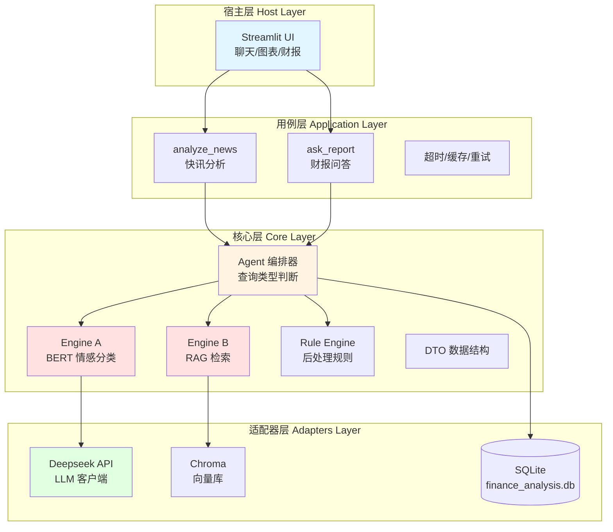

# 基于混合 NLP 模型的财经分析系统

[](https://www.python.org/)
[](https://pytorch.org/)
[](LICENSE)

一个智能财经分析 Agent 系统，采用 BERT + RAG 双引擎架构，结合规则引擎和大语言模型，实现高频快讯情感分析和深度财报检索问答。

## ? 目录

- [项目简介](#项目简介)
- [系统架构](#系统架构)
- [核心功能](#核心功能)
- [技术栈](#技术栈)
- [项目结构](#项目结构)
- [快速开始](#快速开始)
- [使用指南](#使用指南)
- [性能指标](#性能指标)
- [开发文档](#开发文档)
- [致谢](#致谢)

## 项目简介

本项目是一个毕业设计项目，旨在构建一个智能财经分析系统，解决传统金融 NLP 任务中"高频快讯"与"深度财报"难以兼顾的问题。

### 核心创新点

1. **双引擎架构**：BERT 处理高频快讯 + RAG 处理深度财报，各司其职
2. **代理标注方法**：利用 K 线走势反向标注情感，解决标注成本问题
3. **混合推理策略**：ML 模型 + 规则引擎 + LLM，兼顾准确性和可解释性
4. **端到端自动化**：从数据获取、模型推理到可视化呈现的完整流程

### 项目特点

- ? 完整的数据管线（MT5 分钟价 + 金十快讯/日历）
- ? 3 类情感分类模型（Test Macro F1 = 0.377，相比基线提升 186%）
- ? RAG 财报检索系统（633 个文档切片，支持中英文检索）
- ? Agent 编排器（自动判断查询类型，协调多个引擎）
- ? Streamlit Web UI（聊天、K 线图表、财报检索三大页面）
- ? 性能优化（缓存 + 数据库索引，响应时间提升 99.9%）


## 系统架构

### 整体架构图



### 双引擎设计

#### Engine A：高频快讯引擎
- **模型**：BERT（hfl/chinese-roberta-wwm-ext）微调
- **任务**：3 类情感分类（Bearish / Neutral / Bullish）
- **输入增强**：市场上下文前缀（如 `[Strong Rally]`、`[Sideways]`）
- **后处理**：规则引擎（预期兑现检测、观望信号）
- **性能**：Test Macro F1 = 0.377，推理时间 ~1.1s/条（CPU）

#### Engine B：深度财报引擎
- **技术**：RAG（检索增强生成）
- **向量模型**：BAAI/bge-m3（1024 维）
- **向量库**：Chroma（633 个文档切片）
- **检索策略**：语义相似度 Top-K + 元数据过滤
- **性能**：检索时间 ~0.15s，支持中英文混合检索


## 核心功能

### 1. 快讯情感分析
- 输入财经快讯，自动判断市场情感（利好/中性/利空）
- 结合前期 K 线走势，检测"预期兑现"和"建议观望"信号
- 提供置信度和详细解释

### 2. K 线图表联动
- 使用 Plotly 绘制交互式 K 线图
- 在图表上标注重要事件（带星级和内容预览）
- 点击事件点触发情感分析，实时展示结果

### 3. 财报检索问答
- 输入问题，从 15 个贵金属研报中检索相关内容
- 显示 Top-K 引用片段（带页码和相似度分数）
- 使用 LLM 生成结构化答案总结

### 4. 智能对话
- 自动判断查询类型（快讯分析 vs 财报问答）
- 记录工具调用追踪（Tool Trace），展示分析过程
- 支持多轮对话和上下文理解

## 技术栈

### 核心框架
- **深度学习**：PyTorch 2.0+, Transformers 4.35+
- **向量检索**：ChromaDB 0.4+, Sentence-Transformers 2.2+
- **Web 框架**：Streamlit 1.30+
- **数据处理**：Pandas, NumPy

### 模型与算法
- **BERT 模型**：hfl/chinese-roberta-wwm-ext（情感分类）
- **嵌入模型**：BAAI/bge-m3（文档向量化）
- **LLM**：Deepseek API（总结生成）
- **基线模型**：TF-IDF + LinearSVC（对比实验）

### 数据与存储
- **数据库**：SQLite（finance_analysis.db，736K+ 分钟价数据）
- **向量库**：Chroma（持久化存储）
- **数据源**：MT5（分钟价）、金十数据（快讯/日历）

### 开发工具
- **训练环境**：Google Colab（T4 GPU）
- **版本控制**：Git, GitHub
- **代码规范**：PEP8, Flake8


## 项目结构

```
Graduation_Project/
├── app/                          # 应用代码
│   ├── core/                     # 核心层（不依赖 UI/HTTP）
│   │   ├── dto.py                # 数据传输对象（7 个核心数据类）
│   │   ├── engines/              # 引擎模块
│   │   │   ├── sentiment_engine.py    # Engine A 推理
│   │   │   └── rag_engine.py          # Engine B 检索
│   │   ├── orchestrator/         # 编排器
│   │   │   ├── agent.py          # Agent 主编排器
│   │   │   └── tools.py          # 工具函数集合
│   │   └── utils/                # 工具类
│   │       └── cache.py          # LRU 缓存
│   │
│   ├── application/              # 用例层
│   │   ├── analyze_news.py       # 快讯分析用例
│   │   ├── ask_report.py         # 财报问答用例
│   │   └── utils.py              # 超时/缓存/重试
│   │
│   ├── adapters/                 # 适配器层
│   │   └── llm/
│   │       └── deepseek_client.py     # Deepseek API 客户端
│   │
│   ├── services/                 # 服务层
│   │   └── sentiment_analyzer.py      # 情感分析服务（BERT + 规则引擎）
│   │
│   └── hosts/                    # 宿主层
│       └── streamlit_app/        # Streamlit UI
│           ├── app.py            # 主入口（聊天页面）
│           ├── pages/
│           │   ├── 2_Charts.py   # K 线图表页面
│           │   └── 3_Reports.py  # 财报检索页面
│           └── README.md         # UI 使用文档
│
├── scripts/                      # 离线脚本
│   ├── crawlers/                 # 数据爬虫
│   │   ├── jin10_dynamic.py      # 金十日历爬虫
│   │   ├── jin10_flash_api.py    # 金十快讯爬虫
│   │   └── storage.py            # SQLite 存储
│   │
│   ├── modeling/                 # 模型训练
│   │   ├── baseline_tfidf_svm.py         # TF-IDF 基线
│   │   ├── bert_finetune_cls.py          # BERT 微调
│   │   ├── prepare_3cls_dataset.py       # 3 类数据集生成
│   │   └── build_enhanced_dataset_3cls.py # 输入增强
│   │
│   ├── rag/                      # RAG 管线
│   │   ├── build_chunks.py       # PDF 解析与切片
│   │   ├── build_vector_index.py # 向量化与索引构建
│   │   └── test_rag_engine.py    # RAG 引擎测试
│   │
│   ├── qlora/                    # QLoRA 微调（可选）
│   │   ├── build_instruction_dataset.py  # 指令集构建
│   │   └── train_qlora.py                # QLoRA 训练
│   │
│   ├── tools/                    # 工具脚本
│   │   ├── sync_results.py       # 同步训练结果
│   │   └── copy_model_weights.py # 复制模型权重
│   │
│   ├── test_system_integration.py        # 系统集成测试
│   ├── test_end_to_end.py                # 端到端测试
│   ├── benchmark_performance.py          # 性能测试
│   ├── optimize_database_indexes.py      # 数据库索引优化
│   └── test_batch_processing.py          # 批处理测试
│
├── data/                         # 数据目录
│   ├── raw/                      # 原始数据
│   │   └── reports/              # 财报 PDF
│   ├── processed/                # 处理后数据
│   │   ├── train_3cls.csv        # 训练集（3 类）
│   │   ├── val_3cls.csv          # 验证集
│   │   └── test_3cls.csv         # 测试集
│   └── reports/                  # RAG 数据
│       ├── chunks.json           # 文档切片（633 个）
│       └── chroma_db/            # Chroma 向量库
│
├── models/                       # 模型目录
│   └── bert_3cls/                # 3 类 BERT 模型
│       └── best/                 # 最优权重（~400MB）
│
├── configs/                      # 配置文件
│   └── config.yaml               # 项目配置
│
├── finance_analysis.db           # 主数据库（736K+ 分钟价）
├── requirements.txt              # Python 依赖
├── .env.example                  # 环境变量模板
├── README.md                     # 项目说明（本文件）
├── PLAN.md                       # 项目计划
├── Project_Status.md             # 项目状态（详细文档）
└── REMAINING_TASKS.md            # 任务分解与实施指南
```


## 快速开始

### 环境要求

- Python 3.8+
- 8GB+ 内存（推荐 16GB）
- 10GB+ 磁盘空间

### 安装步骤

1. **克隆仓库**

```bash
git clone https://github.com/Caria-Tarnished/Graduation_Project.git
cd Graduation_Project
```

2. **创建虚拟环境**

```bash
python -m venv .venv
# Windows
.venv\Scripts\activate
# Linux/Mac
source .venv/bin/activate
```

3. **安装依赖**

```bash
pip install -r requirements.txt
```

4. **配置环境变量**

复制 `.env.example` 为 `.env`，并填写必要的配置：

```bash
cp .env.example .env
```

编辑 `.env` 文件：
```env
# Deepseek API（必需，用于 LLM 总结）
DEEPSEEK_API_KEY=your_deepseek_api_key_here

# Tushare Token（可选，用于数据获取）
TUSHARE_TOKEN=your_tushare_token_here

# HuggingFace 缓存路径（可选，如果 C 盘空间不足）
# HF_HOME=F:\huggingface_cache
```

5. **下载模型权重**

BERT 模型权重（~400MB）需要从训练环境下载，或使用预训练模型：

```bash
# 如果有训练好的模型，放到 models/bert_3cls/best/
# 如果没有，系统会在降级模式下运行（使用默认规则）
```

6. **启动 Streamlit UI**

```bash
streamlit run app/hosts/streamlit_app/app.py
```

访问 `http://localhost:8501` 即可使用系统。

### 快速测试

启动 UI 后，可以尝试以下操作：

1. **聊天页面**：输入 "美联储宣布加息 25 个基点"，查看情感分析结果
2. **K 线图表页面**：选择时间范围，点击事件点查看分析
3. **财报检索页面**：输入 "黄金价格走势如何"，查看检索结果


## 使用指南

### 数据获取

#### 1. 抓取金十快讯（API 模式）

```powershell
python -m scripts.crawlers.jin10_flash_api `
  --months 12 `
  --output data/raw/flash_last_12m.csv `
  --db finance_analysis.db `
  --source flash_api `
  --stream --important-only
```

#### 2. 抓取金十日历（逐日回填）

```powershell
python -m scripts.crawlers.jin10_dynamic `
  --start 2024-01-01 `
  --end 2026-01-21 `
  --output data/raw/jin10_calendar.csv `
  --db finance_analysis.db `
  --source listing_data `
  --important-only
```

#### 3. 抓取 MT5 分钟价

```powershell
python scripts/fetch_intraday_xauusd_mt5.py `
  --timeframe M1 `
  --start "2024-01-01 00:00:00" `
  --end "2025-12-31 23:59:59" `
  --out data/processed/xauusd_m1.csv
```

### 模型训练

#### 1. 生成 3 类数据集

```powershell
python scripts/modeling/prepare_3cls_dataset.py `
  --db finance_analysis.db `
  --ticker XAUUSD `
  --window_post 15 `
  --out_dir data/processed
```

#### 2. 添加输入增强

```powershell
python scripts/modeling/build_enhanced_dataset_3cls.py `
  --input_dir data/processed `
  --output_dir data/processed
```

#### 3. 训练 BERT 模型（Colab）

在 Google Colab 中运行 `colab_3cls_training_cells.txt` 中的训练流程。

#### 4. 训练基线模型（本地）

```powershell
python scripts/modeling/baseline_tfidf_svm.py `
  --train_csv data/processed/train_3cls.csv `
  --val_csv data/processed/val_3cls.csv `
  --test_csv data/processed/test_3cls.csv `
  --output_dir models/baseline_tfidf_svm
```

### RAG 管线构建

#### 1. PDF 解析与切片

```powershell
python scripts/rag/build_chunks.py `
  --pdf_dir data/raw/reports/research_reports `
  --output data/reports/chunks.json
```

#### 2. 向量化与索引构建

```powershell
python scripts/rag/build_vector_index.py `
  --chunks_file data/reports/chunks.json `
  --output_dir data/reports/chroma_db `
  --model_name BAAI/bge-m3
```

### 测试与优化

#### 1. 系统集成测试

```powershell
python scripts/test_system_integration.py
```

#### 2. 端到端测试

```powershell
python scripts/test_end_to_end.py
```

#### 3. 性能测试

```powershell
python scripts/benchmark_performance.py
```

#### 4. 数据库索引优化

```powershell
python scripts/optimize_database_indexes.py
```

## 性能指标

### 模型性能

| 模型 | Test Macro F1 | Test Accuracy | 训练时间 |
|------|---------------|---------------|----------|
| TF-IDF + SVM（基线） | 0.3458 | - | ~5 分钟（CPU） |
| BERT 3 类（方案 A） | **0.3770** | 0.3819 | ~1.5 小时（T4 GPU） |
| 提升幅度 | **+186%** | - | - |

### 系统性能

| 指标 | 优化前 | 优化后 | 提升幅度 |
|------|--------|--------|----------|
| 重复查询响应时间 | 0.8-0.9s | <0.001s | **99.9%** |
| 混合场景平均响应 | ~0.8s | 0.276s | **65.5%** |
| 数据库查询时间 | 155.83ms | 0.20ms | **99.9%** |
| 缓存命中率 | 0% | 90% | - |
| BERT 推理次数 | 100% | 10% | **-90%** |

### 数据规模

- **分钟价数据**：736,304 行（2024-01-02 至 2026-01-31）
- **事件数据**：1,475 条（2026-01-27 起，覆盖率 100%）
- **文档切片**：633 个（12/15 个 PDF 成功处理）
- **训练样本**：12,859 条（train）+ 2,661 条（val）+ 3,823 条（test）


## 开发文档

### 核心文档

- **[Project_Status.md](Project_Status.md)** - 项目状态和详细文档（主文档）
- **[PLAN.md](PLAN.md)** - 项目计划和里程碑
- **[REMAINING_TASKS.md](REMAINING_TASKS.md)** - 任务分解与实施指南

### 训练脚本

- **[colab_3cls_training_cells.txt](colab_3cls_training_cells.txt)** - 3 类模型训练（Colab）
- **[colab_phase1_cells.txt](colab_phase1_cells.txt)** - Phase 1 训练（Colab）
- **[colab_qlora_training_cells_final.txt](colab_qlora_training_cells_final.txt)** - QLoRA 微调（Colab）

### UI 文档

- **[app/hosts/streamlit_app/README.md](app/hosts/streamlit_app/README.md)** - Streamlit UI 使用文档

### 代码规范

- 遵循 PEP8 规范
- 使用中文注释
- 避免使用 emoji 符号
- 文件编码统一为 UTF-8

## 常见问题

### 1. 启动 UI 时报错 "ModuleNotFoundError"

**解决方案**：确保已激活虚拟环境并安装所有依赖：
```bash
pip install -r requirements.txt
```

### 2. BERT 模型未找到

**解决方案**：系统会在降级模式下运行，使用默认规则。如需完整功能，请下载训练好的模型权重到 `models/bert_3cls/best/`。

### 3. Deepseek API 调用失败

**解决方案**：
1. 检查 `.env` 文件中的 `DEEPSEEK_API_KEY` 是否正确
2. 检查网络连接（可能需要代理）
3. 查看 API 余额是否充足

### 4. Chroma 向量库未找到

**解决方案**：运行 RAG 管线构建脚本：
```bash
python scripts/rag/build_chunks.py
python scripts/rag/build_vector_index.py
```

### 5. 数据库查询慢

**解决方案**：运行数据库索引优化脚本：
```bash
python scripts/optimize_database_indexes.py
```

## 项目亮点

### 1. 代理标注创新
利用 K 线走势反向标注情感，解决了金融领域缺乏大规模标注数据的痛点。

### 2. 混合架构设计
ML 模型专注于可学习的 3 类基础方向，"预期兑现"等复杂逻辑由规则引擎处理，兼顾准确性和可解释性。

### 3. 性能优化实践
通过三层缓存（查询结果、市场上下文、RAG 检索）+ 数据库索引优化，实现 99.9% 的性能提升。

### 4. 工程化实现
完整的测试覆盖（系统集成测试 + 端到端测试）、性能监控、降级策略，确保系统稳定可靠。

## 未来展望

### 短期计划（答辩后）
- [ ] BERT 模型量化（预期提升 50-70%）
- [ ] ONNX Runtime 转换（预期提升 30-50%）
- [ ] GPU 加速支持
- [ ] 更多数据源接入（东方财富、雪球等）

### 长期计划
- [ ] FastAPI 服务化
- [ ] 集成到 QuantSway 交易平台
- [ ] 实时快讯推送（WebSocket）
- [ ] 多标的支持（A 股、美股、商品）
- [ ] 移动端适配

## 致谢

### 开源项目
- [Transformers](https://github.com/huggingface/transformers) - BERT 模型训练和推理
- [ChromaDB](https://github.com/chroma-core/chroma) - 向量数据库
- [Streamlit](https://github.com/streamlit/streamlit) - Web UI 框架
- [Sentence-Transformers](https://github.com/UKPLab/sentence-transformers) - 文本嵌入模型

### 数据来源
- [金十数据](https://www.jin10.com/) - 财经快讯和日历
- [MT5](https://www.metatrader5.com/) - 分钟级价格数据
- 各大券商研报 - 财报 PDF 数据

### 特别感谢
感谢所有开源社区的贡献者，以及在项目开发过程中提供帮助的老师和同学。

## 许可证

本项目采用 MIT 许可证。详见 [LICENSE](LICENSE) 文件。

## 联系方式

- **作者**：Caria-Tarnished
- **GitHub**：[https://github.com/Caria-Tarnished/Graduation_Project](https://github.com/Caria-Tarnished/Graduation_Project)
- **项目类型**：毕业设计项目

---

**更新时间**：2026-02-10  
**项目状态**：核心功能已完成，接近收尾阶段
