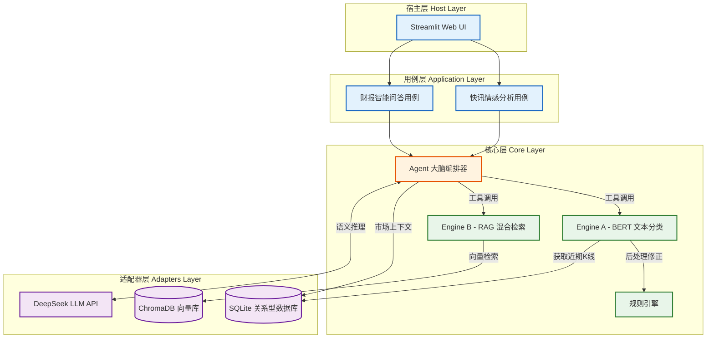
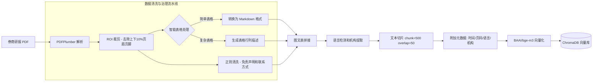
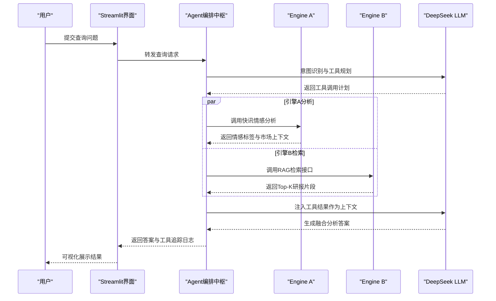
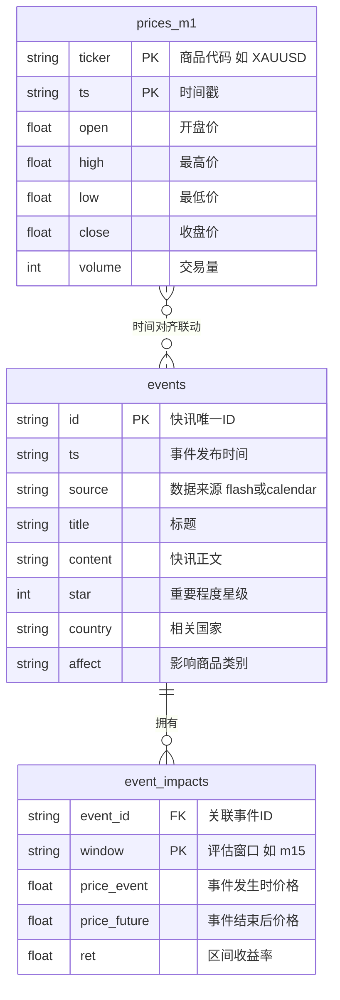

# 毕业论文 Mermaid 逻辑结构图集

在此文件中包含了您论文第四章和第五章所需的核心系统逻辑图与架构图。

> **渲染说明**：建议复制到 [mermaid.live](https://mermaid.live) 选择 v9+ 版本渲染后导出高清 SVG/PNG。Typora 用户请升级到最新版本以确保兼容性。

---

## 1. 总体系统微服务架构图 (第四章 4.1)

---

## 2. Engine A 快讯情感分析算法流与代理标注 (第四章 4.2)

```mermaid
flowchart TD
    subgraph TRAIN["训练阶段 - 走势代理标注"]
        Raw["原始财经快讯"] --> Align["对应事件发生时间 T0"]
        Align --> Window["提取 T0 到 T0+15min 价格窗口"]
        Window --> Calc["计算窗口区间收益率"]
        Calc -->|高于70%分位| L1["利多 +1"]
        Calc -->|低于30%分位| L2["利空 -1"]
        Calc -->|居中| L3["中立 0"]
    end

    subgraph INFER["推理阶段 - 时序特征输入增强"]
        Input["新快讯输入"] --> Context["查询前120分钟市场上下文"]
        Context --> Augment["生成前缀特征 如 Sharp Decline"]
        Input -.-> Concat["拼接: 前缀 + 快讯文本"]
        Augment -.-> Concat

        Concat --> BERT["BERT 文本分类器"]
        BERT --> InitPred["初步情感标签"]

        InitPred --> RuleEngine{"规则引擎检查"}
        RuleEngine -->|前期大涨且当前利好| R1["预期兑现 输出中立或利空"]
        RuleEngine -->|波动率极高且涨幅低| R2["建议观望 输出中立"]
        RuleEngine -->|无冲突| R3["保持原标签"]

        R1 --> Final["最终情感标签输出"]
        R2 --> Final
        R3 --> Final
    end
```

---

## 3. Engine B 财报 RAG 清洗流水线图 (第四章 4.3)

---

## 4. 基于规则路由的 Agent 编排设计图 (第四章 4.4)

---

## 5. 核心数据库 E-R 图 (第五章 5.1)

---
**使用说明**：将各代码块复制到 [mermaid.live](https://mermaid.live) 即可在线渲染并导出高清图片。建议选择 Mermaid **v9 或以上版本**，以避免旧版语法限制。
